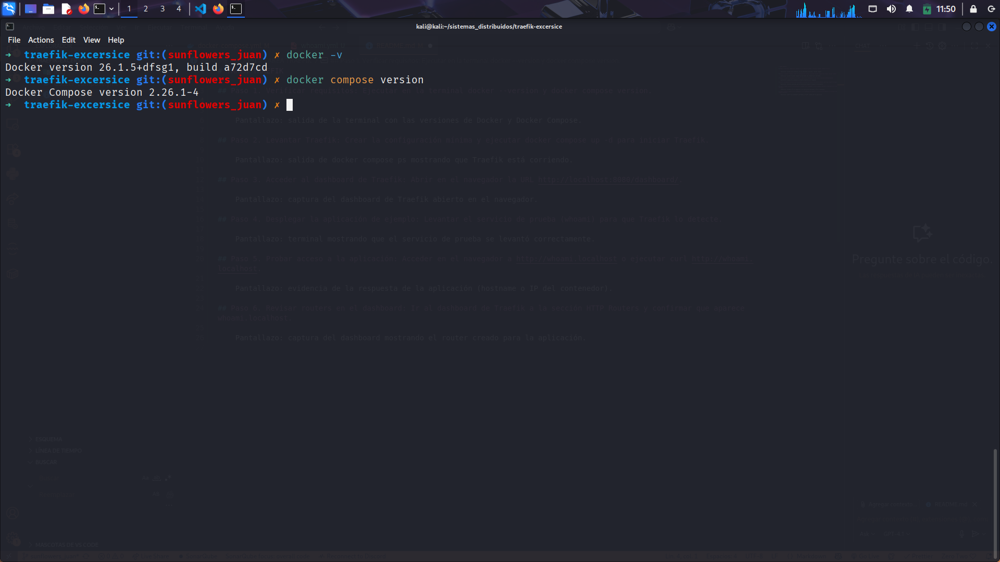
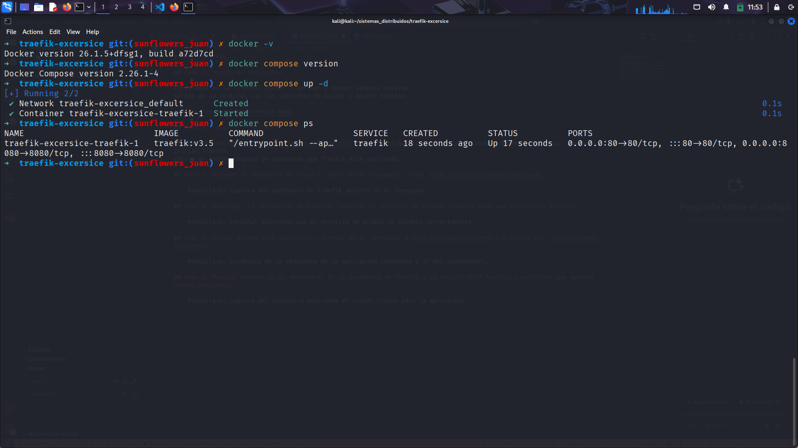
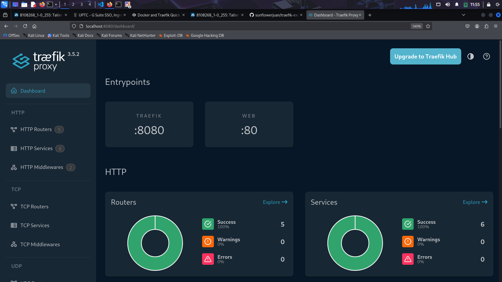
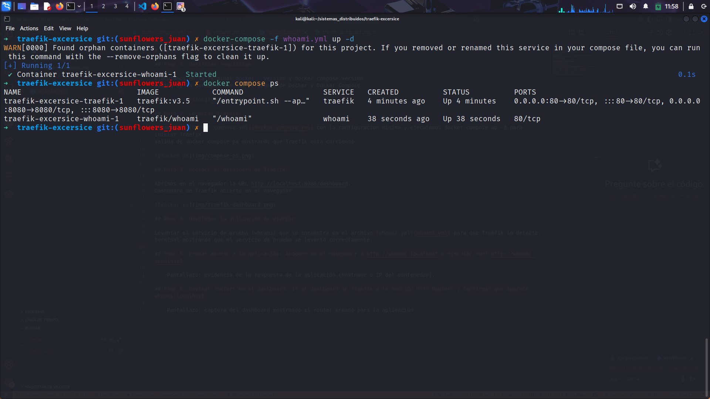
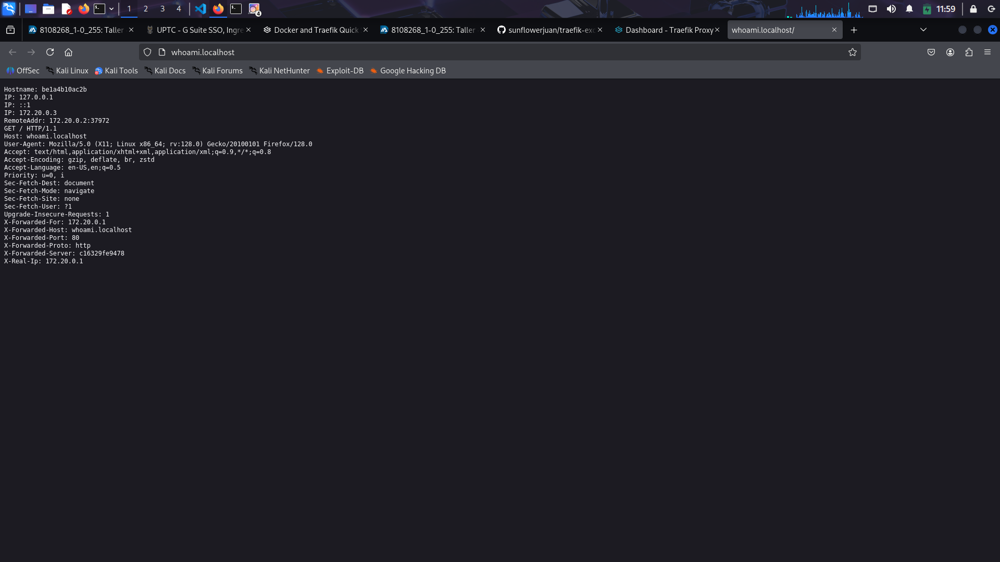
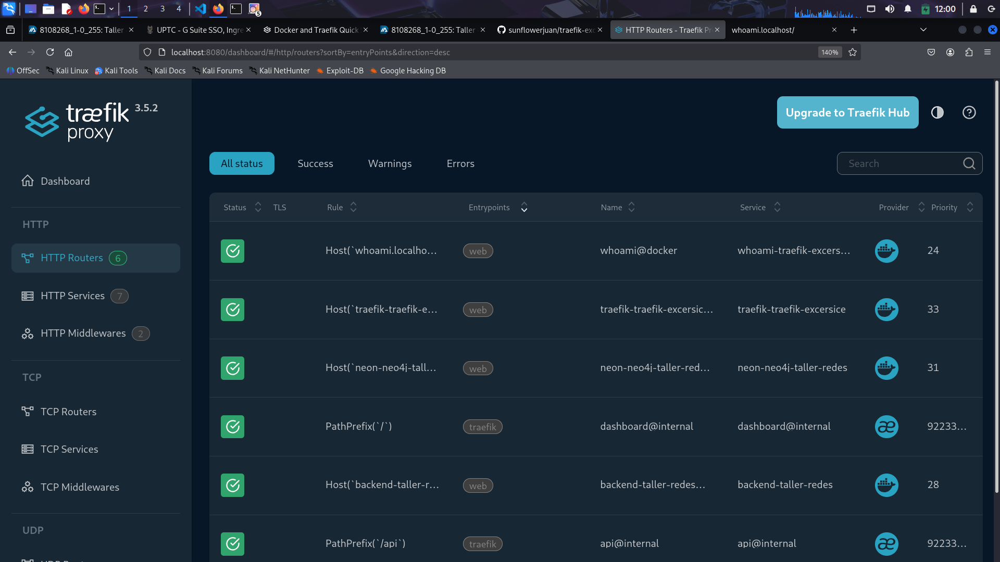

# TAREA TRAEFIK

## Paso 1. Verificar requisitos

Ejecutamos en la terminal docker --version y docker compose version.
salida de la terminal con las versiones de Docker y Docker Compose.

## Paso 2. Levantar Traefik:

Creamos el [docker-compose.yml](docker-compose.yml) con la configuracion minima y ejecutamos `docker compose up -d` para iniciar Traefik.
salida de docker compose ps mostrando que Traefik está corriendo.

## Paso 3. Acceder al dashboard de Traefik:

Abrimos en el navegador la URL http://localhost:8080/dashboard.
Dashboard de Traefik abierto en el navegador.

## Paso 4. Desplegar la aplicación de ejemplo:

Levantar el servicio de prueba (whoami) que se encuentra en el archivo [whoami.yml](whoami.yml) para que Traefik lo detecte.
terminal mostrando que el servicio de prueba se levantó correctamente.

## Paso 5. Probar acceso a la aplicación:

Accedemos en el navegador a http://whoami.localhost, Se muestra a continuacion la evidencia de la respuesta de la aplicación (hostname o IP del contenedor).

## Paso 6. Revisar routers en el dashboard:

Vamos al dashboard de Traefik a la sección HTTP Routers y confirmamos que aparece whoami.localhost. a continuacon se muestra el Dashboard con el router creado para la aplicación.

## PREGUNTAS

1. ¿Qué ventaja aporta enrutar por host (dominio) vs por puerto?

Enrutar por host permite acceder a múltiples servicios usando la misma IP y el mismo puerto, diferenciándolos solo por el dominio. Mientras que, enrutar por puerto obliga a recordar y usar diferentes puertos, lo cual es menos práctico y más difícil de manejar en aplicaciones grandes con multiples servicios.

2. ¿Qué diferencia hay entre labels en los servicios y usar archivos de configuración?

Se definen directamente en el docker-compose.yml o al levantar el contenedor, lo que hace que la configuración esté muy cercana al servicio y sea dinámica. Los archivos de configuración, Permiten separar la lógica de configuración en ficheros externos, más organizados y fáciles de mantener en proyectos grandes.

3. ¿Cómo se entera Traefik de que había servicios nuevos?

Traefik usa providers para “escuchar” los cambios. En el caso de Docker, al ser un provider detecta automáticamente cuando se levantan o se eliminan contenedores con labels configuradas, y actualiza el enrutamiento sin necesidad de reiniciarse.
